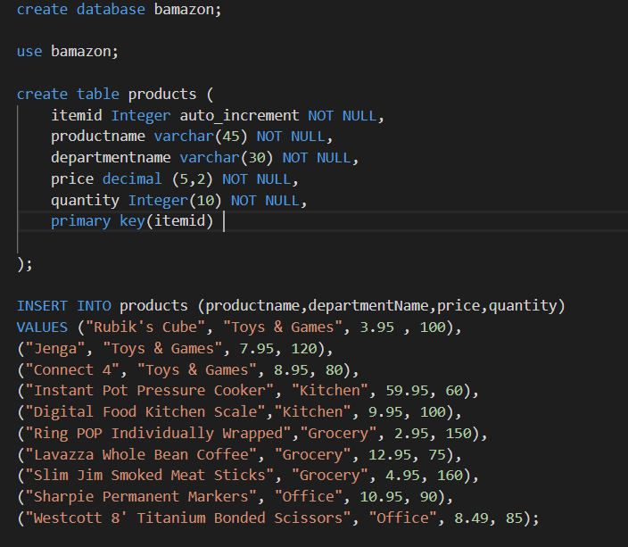
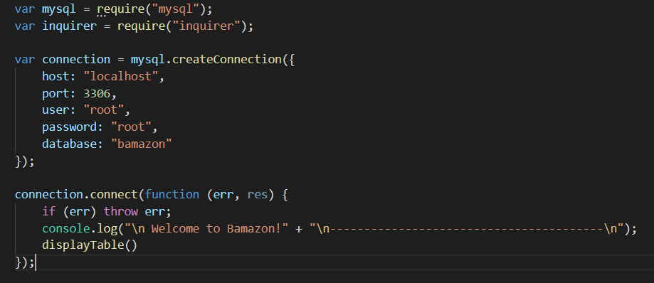
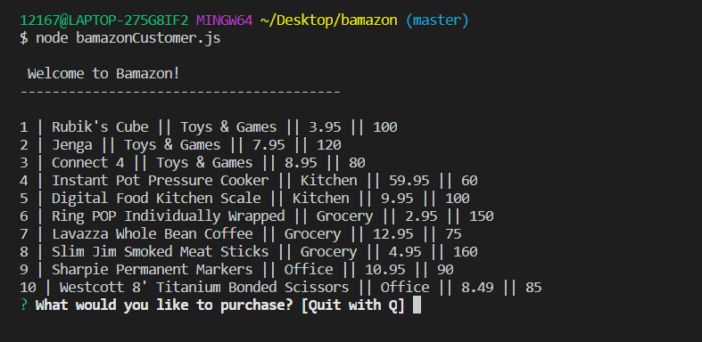
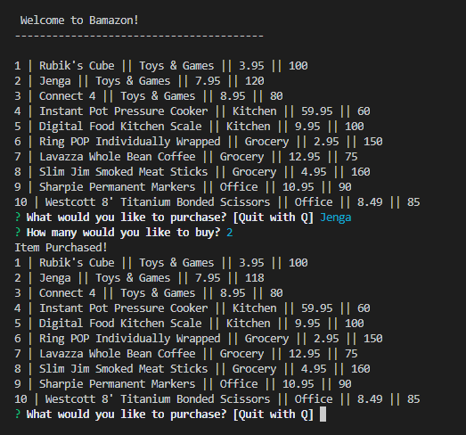
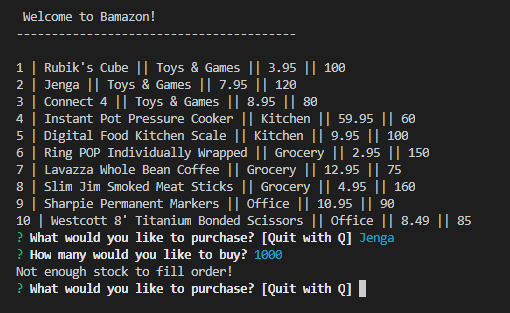
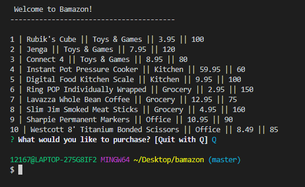

# Bamazon

Welcome to Bamazon! Bamazon is an Amazon-like storefront built using MySQL and Node.js. You can view inventory, choose an item to purchase and the quantity. If there is not enough of an item in stock to fulfill your order the transaction will not be completed.

## Technolgoes used:

* MySQL
* Node.js
* NPM Package- Inquirer

## Creating the database and filling the inventory with products

## Create the connection to the database

## Display the inventory table for user to choose from

### Function

### Output

## Order placed and inventory updated in database

## Not enough inventory to fill order

## Q to end the connection

